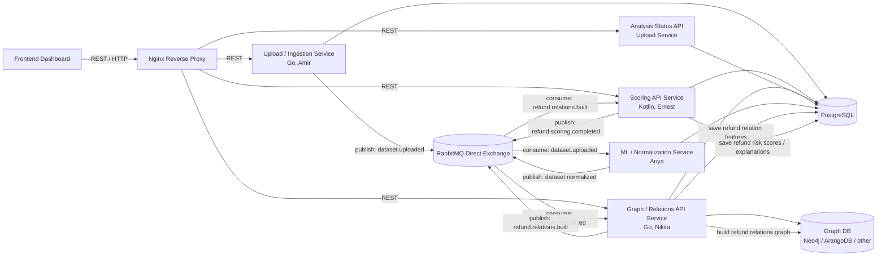

<h1 align="center">Suspicious Refund Approval Detection System</h1>

<p align="center">
  A B2B platform for e-commerce companies that detects suspicious refund approvals by analyzing orders, return requests, and support team decisions.
</p>

---

<h2 align="center">Project Overview</h2>

This project is a fraud and risk analytics system focused on a concrete e-commerce problem: **suspicious refund approvals in customer support workflows**.

The system helps e-commerce companies analyze historical data about:

* customer orders;
* return requests;
* refund amounts;
* support agent decisions;
* approval and decline patterns;
* suspicious customer-agent interactions;
* unusual refund behavior.

The main goal is not only to show raw return data, but to calculate a **refund approval risk score** and explain why a specific refund approval may be suspicious.

The platform is designed for analysts, fraud teams, support managers, and e-commerce operations teams who need to investigate potentially risky refund decisions.

---

<h2 align="center">Track</h2>

**Startup track**

We are building a working MVP for a clear customer segment: **e-commerce companies with a significant number of refund requests and support decisions**.

Potential customer segments include:

* online marketplaces;
* e-commerce stores;
* delivery platforms with order refunds;
* retail platforms with customer support teams;
* companies with high refund volume;
* companies that need refund abuse and support decision monitoring.

This project fits the Startup track because it targets a specific business problem: e-commerce companies can lose money when refund approvals are made too frequently, too quickly, without enough evidence, or by support agents with suspicious approval patterns.

---

<h2 align="center">Problem</h2>

E-commerce companies regularly process refund requests. In many cases, support agents manually decide whether to approve or decline a refund.

This creates several risks:

* customers may abuse the refund process;
* expensive orders may be refunded without enough evidence;
* some customers may request refunds too frequently;
* some support agents may approve too many refund requests;
* the same agent may repeatedly approve refunds for the same customer;
* manual overrides may bypass normal refund rules;
* suspicious approval patterns may be hidden in large datasets.

Manual analysis is slow and does not scale well. Simple checks such as “customer has many refunds” are often not enough because they do not show the full context of the decision.

Our system solves this problem by combining:

* dataset upload;
* data normalization;
* structured storage of orders, returns, and support decisions;
* relationship graph construction;
* rule-based refund approval risk scoring;
* explainable risk reasons;
* analyst dashboard for investigation.

---

<h2 align="center">Architecture Overview</h2>



The MVP consists of the following main parts:

<table align="center">
  <tr>
    <th align="center">Layer</th>
    <th align="center">Responsibility</th>
  </tr>
  <tr>
    <td align="center"><b>Frontend</b></td>
    <td align="center">Analyst dashboard for uploading datasets, viewing analysis status, suspicious refund approvals, risk scores, explanations, and detailed return approval context</td>
  </tr>
  <tr>
    <td align="center"><b>Upload / Ingestion</b></td>
    <td align="center">Go service for uploading e-commerce refund datasets, creating analysis jobs, showing file preview, and publishing processing events to RabbitMQ</td>
  </tr>
  <tr>
    <td align="center"><b>ML / Normalization</b></td>
    <td align="center">Service for mapping raw business columns to internal entities such as orders, returns, customers, support agents, and refund decisions</td>
  </tr>
  <tr>
    <td align="center"><b>Graph / Relations</b></td>
    <td align="center">Go service for building relationships between customers, orders, return requests, support agents, products, and suspicious refund patterns using Graph DB</td>
  </tr>
  <tr>
    <td align="center"><b>Scoring</b></td>
    <td align="center">Kotlin service for calculating refund approval risk score, risk level, and explainable reasons for suspicious approvals</td>
  </tr>
  <tr>
    <td align="center"><b>Storage</b></td>
    <td align="center">PostgreSQL for datasets, analysis jobs, normalized events, refund approval features, scores, and explanations</td>
  </tr>
  <tr>
    <td align="center"><b>Messaging</b></td>
    <td align="center">RabbitMQ direct exchange for asynchronous backend processing pipeline</td>
  </tr>
  <tr>
    <td align="center"><b>Deployment</b></td>
    <td align="center">Docker-based deployment on VM so the project can be opened, tested, and demonstrated</td>
  </tr>
</table>

---

<h2 align="center">Project Resources</h2>

<p align="center">
  This section contains the main technologies used in the project and links to project documentation.
</p>

<table align="center">
  <tr>
    <th align="center">Category</th>
    <th align="center">Item</th>
    <th align="center">Details</th>
  </tr>

  <tr>
    <td align="center" rowspan="9"><b>Tech Stack</b></td>
    <td align="center"><b>Frontend</b></td>
    <td align="center">React / TypeScript</td>
  </tr>
  <tr>
    <td align="center"><b>Upload Service</b></td>
    <td align="center">Go</td>
  </tr>
  <tr>
    <td align="center"><b>Scoring Service</b></td>
    <td align="center">Kotlin / Spring Boot</td>
  </tr>
  <tr>
    <td align="center"><b>Graph / Relations Service</b></td>
    <td align="center">Go</td>
  </tr>
  <tr>
    <td align="center"><b>ML / Normalization</b></td>
    <td align="center">Python</td>
  </tr>
  <tr>
    <td align="center"><b>Database</b></td>
    <td align="center">PostgreSQL</td>
  </tr>
  <tr>
    <td align="center"><b>Graph Storage</b></td>
    <td align="center">Graph DB: Neo4j / ArangoDB / other</td>
  </tr>
  <tr>
    <td align="center"><b>Messaging</b></td>
    <td align="center">RabbitMQ with Direct Exchange</td>
  </tr>
  <tr>
    <td align="center"><b>Deployment</b></td>
    <td align="center">Docker, Docker Compose, VM</td>
  </tr>

  <tr>
    <td colspan="3" align="center">
      <b>━━━━━━━━━━━━━━━━━━━━━━━━━━━━━━━━━━━━━━━━━━━━━━━━━━━━━━━━━━━━━━━━━━━━━━━━━━━━━━━━</b>
    </td>
  </tr>

  <tr>
    <td align="center" rowspan="5"><b>Documentation</b></td>
    <td align="center"><a href="./docs/project-plan.md"><b>Project Plan</b></a></td>
    <td align="center">7-week project plan, milestones, and expected results</td>
  </tr>
  <tr>
    <td align="center"><a href="./docs/architecture.md"><b>Architecture</b></a></td>
    <td align="center">System architecture, components, RabbitMQ pipeline, and data flow</td>
  </tr>
  <tr>
    <td align="center"><a href="./docs/demo-flow.md"><b>Demo Flow</b></a></td>
    <td align="center">Demo scenario for showing the full refund approval analysis workflow</td>
  </tr>
  <tr>
    <td align="center"><a href="./docs/team-roles.md"><b>Team Roles</b></a></td>
    <td align="center">Team responsibilities and weekly report schedule</td>
  </tr>
  <tr>
    <td align="center"><a href="./docs/reports/"><b>Weekly Reports</b></a></td>
    <td align="center">Weekly progress reports from Week 2 to Week 7</td>
  </tr>
</table>

---

<h2 align="center">Core Domain Entities</h2>

The system works with e-commerce refund approval data.

Main entities:

* **Customer** — user who placed an order and requested a refund.
* **Order** — purchase made by a customer.
* **Return Request** — request to return an item or receive a refund.
* **Support Agent** — employee who approved or declined the return request.
* **Decision** — support action: approve, decline, manual override, or escalation.
* **Product / Category** — item or category involved in the order and return.
* **Refund Approval** — final approved refund decision that may be normal or suspicious.

Example normalized structure:

```json
{
  "returnId": "return_123",
  "orderId": "order_456",
  "customerId": "customer_789",
  "supportAgentId": "agent_001",
  "orderAmount": 249.99,
  "refundAmount": 249.99,
  "returnReason": "item_not_as_described",
  "evidenceProvided": false,
  "decision": "APPROVED",
  "manualOverride": true,
  "decisionTimeMinutes": 2,
  "timestamp": "2026-06-01T10:00:00Z"
}
```

---

<h2 align="center">Risk Scoring</h2>

The scoring service calculates a risk score for a specific refund approval.

The main scoring target is:

```text
Refund approval risk score
```

Risk factors may include:

* high refund amount;
* refund amount close to full order amount;
* refund approved without evidence;
* very fast approval;
* manual override;
* support agent with unusually high approval rate;
* customer with frequent refund requests;
* repeated refund reasons;
* repeated customer-agent interactions;
* suspicious refund cluster in graph data.

Example scoring response:

```json
{
  "returnId": "return_123",
  "orderId": "order_456",
  "customerId": "customer_789",
  "supportAgentId": "agent_001",
  "riskScore": 84,
  "riskLevel": "HIGH",
  "topReason": "Refund approved without evidence for a high-value order",
  "reasons": [
    {
      "type": "NO_EVIDENCE",
      "message": "Refund was approved without required evidence",
      "scoreImpact": 25
    },
    {
      "type": "HIGH_VALUE_REFUND",
      "message": "Refund amount is unusually high",
      "scoreImpact": 20
    },
    {
      "type": "AGENT_HIGH_APPROVAL_RATE",
      "message": "Support agent has unusually high approval rate",
      "scoreImpact": 30
    }
  ]
}
```

---

<h2 align="center">RabbitMQ Processing Pipeline</h2>

Backend processing is asynchronous because dataset analysis may take time and consists of multiple independent stages.

The pipeline:

1. Upload service receives a dataset.
2. Upload service creates an analysis job.
3. Upload service publishes `dataset.uploaded`.
4. ML / Normalization service consumes `dataset.uploaded`.
5. ML / Normalization service saves normalized data and publishes `dataset.normalized`.
6. Graph / Relations service consumes `dataset.normalized`.
7. Graph / Relations service builds refund relations and publishes `refund.relations.built`.
8. Scoring service consumes `refund.relations.built`.
9. Scoring service calculates risk scores and publishes `refund.scoring.completed`.
10. Frontend reads analysis status and results through REST API.

Planned analysis statuses:

* `UPLOADED`;
* `NORMALIZING`;
* `NORMALIZED`;
* `BUILDING_RELATIONS`;
* `SCORING`;
* `COMPLETED`;
* `FAILED`.

---

<h2 align="center">MVP Goal</h2>

By the end of the project, we aim to build a working MVP that demonstrates the full refund approval analysis flow:

1. A business user uploads an e-commerce refund dataset.
2. The system shows dataset preview.
3. The system detects or applies column mapping.
4. Raw data is normalized into internal order, return, customer, and support decision entities.
5. The system builds relationships between customers, orders, returns, support agents, and products.
6. A refund approval risk score is calculated.
7. The system explains why a refund approval is suspicious.
8. An analyst views suspicious refund approvals in the dashboard.
9. The project is deployed on a VM and can be demonstrated.

---

<h2 align="center">Demo Flow</h2>

Final demo scenario:

1. Upload a CSV dataset with orders, return requests, and support decisions.
2. Show dataset preview and mapping.
3. Start analysis.
4. Show analysis status moving through the RabbitMQ pipeline.
5. Open suspicious refund approvals dashboard.
6. Select a suspicious refund approval.
7. Show risk score, risk level, explanations, related support agent, customer history, and relation context.
8. Demonstrate why the system considers the refund approval suspicious.

---

<h2 align="center">Team Responsibilities</h2>

<table align="center">
  <tr>
    <th align="center">Team Member</th>
    <th align="center">Responsibility</th>
  </tr>
  <tr>
    <td align="center"><b>Amir</b></td>
    <td align="center">Upload / Ingestion Service, CSV upload, dataset preview, analysis job creation, Nginx routing</td>
  </tr>
  <tr>
    <td align="center"><b>Anya</b></td>
    <td align="center">ML / Data Normalization, synthetic refund datasets, column mapping, normalized refund event format</td>
  </tr>
  <tr>
    <td align="center"><b>Nikita</b></td>
    <td align="center">Graph / Relations Service, Graph DB, refund relation graph, customer-agent-return connections</td>
  </tr>
  <tr>
    <td align="center"><b>Ernest</b></td>
    <td align="center">Kotlin Scoring Service, refund approval risk score, risk level, explanations</td>
  </tr>
  <tr>
    <td align="center"><b>Islam</b></td>
    <td align="center">Frontend Dashboard, upload flow, analysis status page, suspicious approvals table, refund approval details page</td>
  </tr>
  <tr>
    <td align="center"><b>Amina</b></td>
    <td align="center">DevOps / Infrastructure, Docker Compose, PostgreSQL, RabbitMQ, Graph DB, VM deployment</td>
  </tr>
</table>

---

<h2 align="center">Bonus Goals</h2>

Optional bonus functionality may include:

* ML-assisted anomaly detection for refund approvals;
* comparison between rule-based and ML-assisted scoring;
* validation metrics such as precision, recall, F1-score, and confusion matrix;
* improved explainability with factor contribution to the final risk score;
* interactive graph visualization of suspicious refund relations;
* support agent risk summary;
* customer return behavior analytics;
* export of suspicious refund approval reports.

---

<h2 align="center">Project Status</h2>

The project is currently in progress.

The current focus is Week 1 implementation:

* service skeletons;
* dataset upload flow;
* synthetic refund dataset;
* RabbitMQ pipeline setup;
* graph relations model;
* refund approval scoring model;
* frontend dashboard mock flow;
* Docker-based local infrastructure.

As the system evolves, we will add more details about architecture, API endpoints, data models, deployment, demo flow, validation, and weekly progress.
