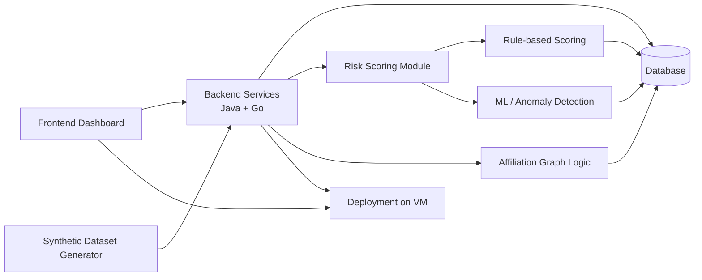

<h1 align="center">Fraud & Abuse Detection System</h1>

  A system for detecting related accounts, multi-accounting, self-referral, promo abuse, and suspicious user behavior in digital services.

---

<h2 align="center">Project Overview</h2>

This project is a fraud and abuse detection system that analyzes user events and helps identify suspicious behavior patterns.

The system is designed to detect cases where:

* multiple accounts use the same device;
* different users frequently log in from the same IP address;
* users create self-referral chains;
* promo codes are used in a suspicious way;
* accounts are connected through devices, IP addresses, promo codes, referrals, or user actions.

The main goal is not only to show raw data, but to calculate a user risk score and explain why a user or group of users is considered suspicious.

---

<h2 align="center">Track</h2>

**Startup track**

We are building a working MVP for a clear customer segment: digital services that use promo codes, referral programs, bonuses, user campaigns, or have risks related to multi-accounting.

*Potential customer segments include:* fintech services, marketplaces, e-commerce platforms, delivery services, edtech platforms, subscription-based digital products.

---

<h2 align="center">Problem</h2>

Many digital products use promo codes, bonuses, and referral programs to attract and retain users. However, these mechanics can be abused through multi-accounting, self-referrals, repeated promo usage, shared devices, shared IP addresses, and coordinated fake activity.

Simple checks such as “one IP address is used by many accounts” are often not enough. They can produce many false positives and do not show the full picture of how accounts are connected.

Our system solves this problem by combining:

* event collection;
* structured data storage;
* relationship graph construction;
* rule-based risk scoring;
* explainable suspicious behavior detection;
* analyst dashboard for investigation.

---

<h2 align="center">Architecture Overview</h2>

The MVP consists of the following main parts:

<table align="center">
  <tr>
    <th align="center">Layer</th>
    <th align="center">Responsibility</th>
  </tr>
  <tr>
    <td align="center"><b>Frontend</b></td>
    <td align="center">Analyst dashboard for viewing suspicious users, risk scores, explanations, related accounts, and basic event history</td>
  </tr>
  <tr>
    <td align="center"><b>Backend</b></td>
    <td align="center">Java and Go services for event ingestion, user data access, risk score calculation, and communication between system components</td>
  </tr>
  <tr>
    <td align="center"><b>Storage</b></td>
    <td align="center">Database for users, events, devices, IP addresses, promo codes, referrals, and calculated risk results</td>
  </tr>
  <tr>
    <td align="center"><b>Scoring & ML</b></td>
    <td align="center">Rule-based risk scoring, explanations, and optional ML-assisted anomaly detection</td>
  </tr>
  <tr>
    <td align="center"><b>Deployment</b></td>
    <td align="center">VM deployment so the project can be opened, tested, and demonstrated</td>
  </tr>
</table>

---

<h2 align="center">Project Resources</h2>

  This section contains the main technologies used in the project and links to project documentation.

<table align="center">
  <tr>
    <th align="center">Category</th>
    <th align="center">Item</th>
    <th align="center">Details</th>
  </tr>

  <tr>
    <td align="center" rowspan="7"><b>Tech Stack</b></td>
    <td align="center"><b>Frontend</b></td>
    <td align="center">React / TypeScript</td>
  </tr>
  <tr>
    <td align="center"><b>Backend</b></td>
    <td align="center">Java, Go</td>
  </tr>
  <tr>
    <td align="center"><b>Database</b></td>
    <td align="center">PostgreSQL</td>
  </tr>
  <tr>
    <td align="center"><b>Data Generation</b></td>
    <td align="center">Python</td>
  </tr>
  <tr>
    <td align="center"><b>ML / Anomaly Detection</b></td>
    <td align="center">Python, scikit-learn</td>
  </tr>
  <tr>
    <td align="center"><b>Deployment</b></td>
    <td align="center">Docker, VM</td>
  </tr>
  <tr>
    <td align="center"><b>Documentation Format</b></td>
    <td align="center">Markdown, GitHub Docs</td>
  </tr>

<tr>
  <td colspan="3" align="center">
    <b>━━━━━━━━━━━━━━━━━━━━━━━━━━━━━━━━━━━━━━━━━━━━━━━━━━━━━━━━━━━━━━━━━━━━━━━━━━━━━━━━</b>
  </td>
</tr>

  <tr>
    <td align="center" rowspan="5"><b>Documentation</b></td>
    <td align="center"><a href="./docs/project-plan.md"><b>Project Plan</b></a></td>
    <td align="center">7-week project plan, milestones, and expected results</td>
  </tr>
  <tr>
    <td align="center"><a href="./docs/architecture.md"><b>Architecture</b></a></td>
    <td align="center">System architecture, components, and data flow</td>
  </tr>
  <tr>
    <td align="center"><a href="./docs/demo-flow.md"><b>Demo Flow</b></a></td>
    <td align="center">Demo scenario for showing the full MVP workflow</td>
  </tr>
  <tr>
    <td align="center"><a href="./docs/team-roles.md"><b>Team Roles</b></a></td>
    <td align="center">Team responsibilities and weekly report schedule</td>
  </tr>
  <tr>
    <td align="center"><a href="./docs/reports/"><b>Weekly Reports</b></a></td>
    <td align="center">Weekly progress reports from Week 2 to Week 7</td>
  </tr>
</table>

---

<h2 align="center">MVP Goal</h2>

By the end of the project, we aim to build a working MVP that demonstrates the full data flow:

1. User events are sent to the backend API.
2. Events are stored in the database.
3. The system builds links between users, devices, IP addresses, promo codes, and referrals.
4. A risk score is calculated for each user.
5. The system explains why the score is high.
6. An analyst can view suspicious users in the dashboard.
7. The project is deployed on a VM and can be demonstrated.

---

<h2 align="center">Bonus Goals</h2>

Optional bonus functionality may include:

* ML-assisted or anomaly detection scoring;
* comparison between rule-based and hybrid scoring;
* validation metrics such as precision, recall, F1-score, and confusion matrix;
* improved explainability with factor contribution to the final risk score;
* interactive graph visualization of user connections.

---

<h2 align="center">Project Status</h2>
  The Project is currently in progress and will be updated throughout the time (As the system evolves, we will add more details about architecture, API endpoints, data models, deployment, demo flow, and weekly progress.)