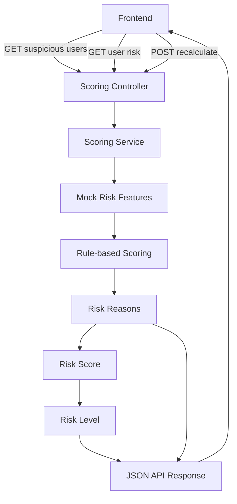

<h1 align="center">Scoring Service</h1>

<p align="center">
  The service provides risk scores, risk levels, explanations, and mock suspicious users for the frontend during the first development stage.
</p>

<p align="center">
  
  
  
  
</p>

<p align="center">
  
  
</p>

<h2 align="center">Service Flow</h2>



<h2 align="center">Rule-based Scoring Draft</h2>

<div align="center">

<table>
  <thead>
    <tr>
      <th align="center">Feature</th>
      <th align="center">Condition</th>
      <th align="center">Score Impact</th>
    </tr>
  </thead>
  <tbody>
    <tr>
      <td align="center">Same device usage</td>
      <td align="center"><code>sameDeviceUserCount &gt;= 3</code></td>
      <td align="center"><code>+30</code></td>
    </tr>
    <tr>
      <td align="center">Same IP usage</td>
      <td align="center"><code>sameIpUserCount &gt;= 3</code></td>
      <td align="center"><code>+20</code></td>
    </tr>
    <tr>
      <td align="center">Promo abuse</td>
      <td align="center"><code>promoUsageCount &gt;= 5</code></td>
      <td align="center"><code>+20</code></td>
    </tr>
    <tr>
      <td align="center">Suspicious referral</td>
      <td align="center"><code>hasSuspiciousReferral == true</code></td>
      <td align="center"><code>+30</code></td>
    </tr>
  </tbody>
</table>

</div>


<h2 align="center">API Endpoints</h2>

<div align="center">

<table>
  <thead>
    <tr>
      <th align="center">Endpoint</th>
      <th align="center">Command</th>
    </tr>
  </thead>
  <tbody>
    <tr>
      <td align="center">Health Check</td>
      <td align="left"><code>curl http://localhost:8081/api/scoring/health</code></td>
    </tr>
    <tr>
      <td align="center">Get Suspicious Users</td>
      <td align="left"><code>curl http://localhost:8081/api/scoring/datasets/demo/suspicious-users | jq</code></td>
    </tr>
    <tr>
      <td align="center">Get User Risk</td>
      <td align="left"><code>curl http://localhost:8081/api/scoring/users/user_123/risk | jq</code></td>
    </tr>
    <tr>
      <td align="center">Recalculate Dataset</td>
      <td align="left"><code>curl -X POST http://localhost:8081/api/scoring/datasets/demo/recalculate | jq</code></td>
    </tr>
  </tbody>
</table>

</div>


<h2 align="center">Example Suspicious User Response</h2>

```json
{
  "userId": "user_123",
  "riskScore": 87,
  "riskLevel": "HIGH",
  "topReason": "Same device used by 5 users",
  "relatedUsersCount": 6
}
```

<h2 align="center">Local Run, Build and Test</h2>

<div align="center">

<table>
  <thead>
    <tr>
      <th align="center">Action</th>
      <th align="center">Command</th>
      <th align="center">Result</th>
    </tr>
  </thead>
  <tbody>
    <tr>
      <td align="center">Run service</td>
      <td align="left"><code>./gradlew bootRun</code></td>
      <td align="left">Starts the service on <code>http://localhost:8081</code></td>
    </tr>
    <tr>
      <td align="center">Build and test</td>
      <td align="left"><code>./gradlew clean build</code></td>
      <td align="left">Compiles the project and runs tests</td>
    </tr>
  </tbody>
</table>

</div>

