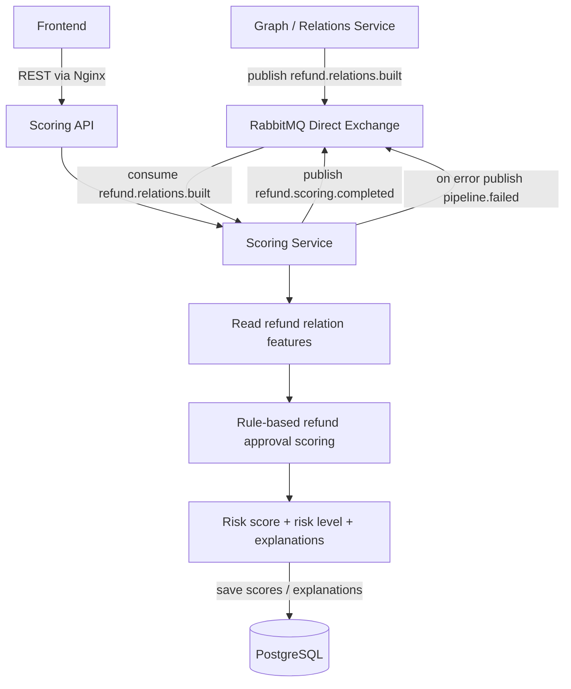

<h1 align="center">Scoring Service</h1>

The Scoring Service calculates refund approval risk scores for suspicious refund approvals in e-commerce support workflows.

It is responsible for:

* `RefundApprovalRiskScore`;
* `SuspiciousRefundApproval`;
* risk levels;
* scoring rules;
* explanations;
* suspicious refund approvals API;
* consuming `refund.relations.built`;
* publishing `refund.scoring.completed`.

<h2 align="center">Service Flow</h2>



<h2 align="center">API Endpoints</h2>

```text
GET /api/scoring/health
GET /api/scoring/datasets/{datasetId}/suspicious-approvals
GET /api/scoring/returns/{returnId}/risk
GET /api/scoring/agents/{agentId}/risk-summary
POST /api/scoring/datasets/{datasetId}/recalculate
```

<h2 align="center">Risk Factors</h2>

```text
NO_EVIDENCE
HIGH_VALUE_REFUND
FULL_AMOUNT_REFUND
FAST_APPROVAL
MANUAL_OVERRIDE
AGENT_HIGH_APPROVAL_RATE
CUSTOMER_FREQUENT_RETURNS
REPEATED_AGENT_CUSTOMER_PAIR
SUSPICIOUS_CLUSTER
```

<h2 align="center">Rule-Based Scoring Draft</h2>

| Rule | Condition | Score Impact |
| --- | --- | --- |
| NO_EVIDENCE | Refund approved without evidence | +25 |
| HIGH_VALUE_REFUND | Refund amount is above threshold | +20 |
| FULL_AMOUNT_REFUND | Refund amount is close to order amount | +15 |
| FAST_APPROVAL | Approval happened too quickly | +15 |
| MANUAL_OVERRIDE | Manual override was used | +20 |
| AGENT_HIGH_APPROVAL_RATE | Agent approval rate is unusually high | +30 |
| CUSTOMER_FREQUENT_RETURNS | Customer has many refund requests | +20 |
| REPEATED_AGENT_CUSTOMER_PAIR | Same agent repeatedly approves same customer | +25 |
| SUSPICIOUS_CLUSTER | Approval belongs to suspicious graph cluster | +25 |

<h2 align="center">Risk Levels</h2>

```text
0-30 LOW
31-60 MEDIUM
61-80 HIGH
81-100 CRITICAL
```

<h2 align="center">Events</h2>

Consumes:

```text
refund.relations.built
```

Publishes:

```text
refund.scoring.completed
```

<h2 align="center">Example Suspicious Refund Approval Response</h2>

```json
{
  "returnId": "return_123",
  "orderId": "order_456",
  "customerId": "customer_789",
  "supportAgentId": "agent_001",
  "refundAmount": 249.99,
  "decision": "APPROVED",
  "riskScore": 84,
  "riskLevel": "HIGH",
  "topReason": "Refund approved without evidence for a high-value order",
  "reasons": [
    {
      "type": "NO_EVIDENCE",
      "message": "Refund was approved without required evidence",
      "scoreImpact": 25
    },
    {
      "type": "HIGH_VALUE_REFUND",
      "message": "Refund amount is above threshold",
      "scoreImpact": 20
    },
    {
      "type": "AGENT_HIGH_APPROVAL_RATE",
      "message": "Support agent approval rate is unusually high",
      "scoreImpact": 30
    }
  ]
}
```
