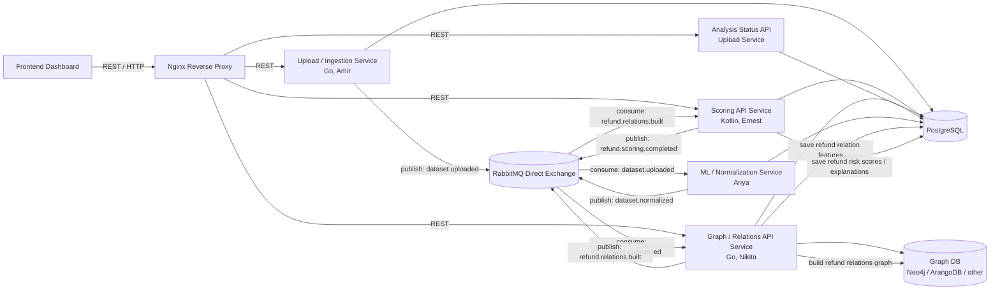

<h1 align="center">Architecture</h1>

This document describes the high-level architecture of the Fraud & Abuse Detection System MVP.

Fraud & Abuse Detection System is a B2B platform for e-commerce companies that detects suspicious refund approvals by analyzing order history, return requests, and customer support decisions.

<h2 align="center">Architecture Overview</h2>

The system focuses on detecting suspicious refund approvals in e-commerce support workflows. It analyzes orders, return requests, refund amounts, support agent decisions, customer return history, support agent approval behavior, and suspicious customer-agent interactions.

Nginx is the single external entry point. The frontend communicates only through REST APIs exposed by Nginx. Backend processing is asynchronous through RabbitMQ so that upload, normalization, graph building, and scoring can run as separate stages without forcing the frontend to wait for one long HTTP request.

<h2 align="center">High-Level Architecture Diagram</h2>



<h2 align="center">System Components</h2>

| Component | Description |
| --- | --- |
| Frontend Dashboard | Analyst interface for dataset upload, preview, analysis status, suspicious refund approvals, and refund approval details. |
| Nginx Reverse Proxy | Single external entry point that routes frontend REST requests to backend services. |
| Upload / Ingestion Service | Handles CSV upload, dataset metadata, preview, analysis job creation, status API, and `dataset.uploaded` publishing. |
| ML / Normalization Service | Maps raw business CSV columns into internal order, return, customer, support agent, and decision entities. |
| Graph / Relations Service | Builds refund relation graph data and extracts relationship features for scoring. |
| Scoring Service | Calculates refund approval risk score, risk level, and explainable risk reasons. |
| PostgreSQL | Stores datasets, jobs, normalized entities, relation features, risk scores, and explanations. |
| RabbitMQ Direct Exchange | Connects backend processing stages through domain events. |
| Graph DB | Stores customer, order, return request, support agent, decision, and product category relationships. |

<h2 align="center">Backend Pipeline</h2>

```text
dataset.uploaded
-> dataset.normalized
-> refund.relations.built
-> refund.scoring.completed
```

The pipeline works as follows:

1. A business user uploads an e-commerce refund dataset.
2. Upload / Ingestion Service stores metadata and publishes `dataset.uploaded`.
3. ML / Normalization Service consumes `dataset.uploaded`, normalizes rows, and publishes `dataset.normalized`.
4. Graph / Relations Service consumes `dataset.normalized`, builds refund relations, stores relation features, and publishes `refund.relations.built`.
5. Scoring Service consumes `refund.relations.built`, calculates risk scores and explanations, and publishes `refund.scoring.completed`.
6. Upload / Ingestion Service or status API exposes analysis status to the frontend.

<h2 align="center">Why RabbitMQ Is Used</h2>

RabbitMQ is used because:

* dataset processing may take time;
* normalization, graph building, and scoring are separate stages;
* the frontend should not wait for one long HTTP request;
* services are decoupled;
* analysis status can be tracked.

<h2 align="center">Why Graph DB Is Used</h2>

Refund approval risk depends on relationships, not only on single rows.

Graph DB is useful for:

* customer-agent-return-product relations;
* repeated customer-agent interactions;
* suspicious refund clusters;
* support agents with abnormal approval behavior;
* customers with frequent return activity;
* relation features that improve refund approval risk scoring.

The graph model is:

```text
Customer -> Order -> Return Request -> Support Agent -> Decision -> Product Category
```

<h2 align="center">Main Data Entities</h2>

| Entity | Purpose |
| --- | --- |
| Customer | Buyer who placed orders and requested returns. |
| Order | E-commerce purchase that may have a return request. |
| ReturnRequest | Request for return or refund. |
| SupportAgent | Support employee who approved or declined the request. |
| Decision | Approval, decline, manual override, or escalation decision. |
| ProductCategory | Product group related to the order and return request. |
| RefundApprovalRiskScore | Calculated risk score for a refund approval. |
| RiskExplanation | Human-readable explanation of why a refund approval is suspicious. |

<h2 align="center">Risk Scoring Logic</h2>

The MVP uses rule-based scoring for refund approvals.

Example risk factors:

* high-value refund approved without evidence;
* refund approved too quickly;
* manual override on expensive order;
* customer requests refunds too frequently;
* support agent has unusually high approval rate;
* same agent repeatedly approves refunds for the same customer;
* refund amount is close to full order amount;
* suspicious refund cluster in the relation graph.

Risk levels:

```text
0-30 LOW
31-60 MEDIUM
61-80 HIGH
81-100 CRITICAL
```

<h2 align="center">Explainability Logic</h2>

For each suspicious refund approval, the system should explain the main reasons behind the score.

Examples:

* refund approved without evidence;
* high-value refund approved with manual override;
* refund amount is close to full order amount;
* support agent approval rate is unusually high;
* customer has frequent refund requests;
* repeated approvals between the same customer and support agent;
* approval belongs to a suspicious refund relation cluster.

<h2 align="center">Deployment Overview</h2>

The MVP should be deployed on a VM using Docker Compose.

Deployment should include:

* frontend dashboard;
* Nginx reverse proxy;
* Upload / Ingestion Service;
* ML / Normalization Service;
* Graph / Relations Service;
* Scoring Service;
* PostgreSQL;
* RabbitMQ;
* Graph DB.

The final demo should show the complete flow from dataset upload to suspicious refund approval investigation.
