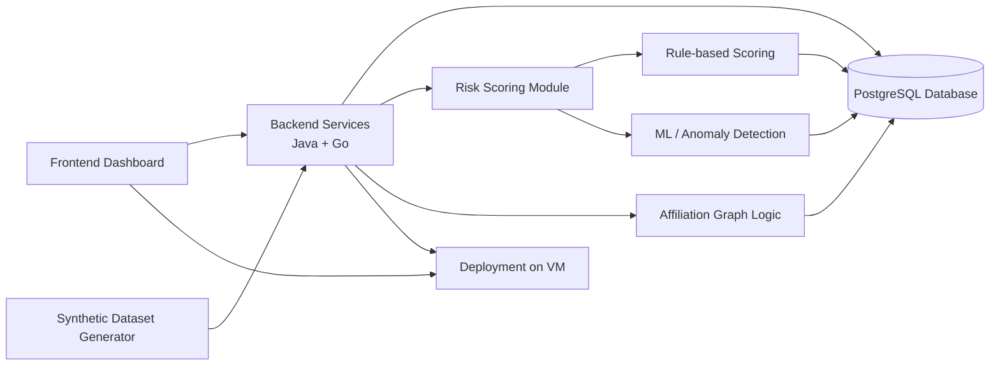

<h1 align="center">Architecture</h1>

  This document describes the high-level architecture of the Fraud & Abuse Detection System MVP.

  The architecture is a work in progress and may be updated as the MVP evolves.

---

<h2 align="center">Architecture Overview</h2>

The system is designed to analyze user events, detect suspicious relationships between accounts, calculate risk scores, and provide explanations for analysts.

The MVP consists of several main parts:

* frontend dashboard;
* backend services written in Java and Go;
* PostgreSQL database;
* synthetic dataset generator;
* affiliation graph logic;
* risk scoring module;
* optional ML / anomaly detection layer;
* deployment on a VM.

---

<h2 align="center">High-Level Architecture Diagram</h2>

---

<h2 align="center">System Components</h2>

<table align="center">
  <tr>
    <th align="center">Component</th>
    <th align="center">Description</th>
  </tr>
  <tr>
    <td align="center"><b>Frontend Dashboard</b></td>
    <td align="center">Analyst interface for viewing suspicious users, risk scores, risk explanations, related accounts, and basic event history.</td>
  </tr>
  <tr>
    <td align="center"><b>Backend Services</b></td>
    <td align="center">Java and Go services responsible for event ingestion, API endpoints, business logic, risk score access, and communication between system components.</td>
  </tr>
  <tr>
    <td align="center"><b>PostgreSQL Database</b></td>
    <td align="center">Storage for users, events, devices, IP addresses, promo codes, referrals, calculated risk scores, and explanations.</td>
  </tr>
  <tr>
    <td align="center"><b>Synthetic Dataset Generator</b></td>
    <td align="center">Python-based generator for normal user activity and predefined fraud scenarios such as multi-accounting, shared devices, shared IPs, self-referral, and promo abuse.</td>
  </tr>
  <tr>
    <td align="center"><b>Affiliation Graph Logic</b></td>
    <td align="center">Logic for finding relationships between users and entities such as devices, IP addresses, promo codes, referrals, and suspicious actions.</td>
  </tr>
  <tr>
    <td align="center"><b>Risk Scoring Module</b></td>
    <td align="center">Module for calculating user risk scores using rule-based logic and, optionally, ML-assisted or anomaly detection approaches.</td>
  </tr>
  <tr>
    <td align="center"><b>Deployment</b></td>
    <td align="center">Docker and VM-based deployment that allows the TA and project team to open, test, and demonstrate the MVP.</td>
  </tr>
</table>

---

<h2 align="center">Data Flow</h2>

The basic MVP data flow is:

1. Synthetic user events are generated.
2. Events are sent to the backend API.
3. Backend services validate and process incoming events.
4. Events and related entities are saved to the PostgreSQL database.
5. The affiliation graph logic builds relationships between users, devices, IP addresses, promo codes, and referrals.
6. The risk scoring module calculates a risk score for each user.
7. The system generates explanations for suspicious users.
8. The frontend dashboard requests suspicious user data from the backend.
9. Analysts review users, risk scores, explanations, related accounts, and event history.

---

<h2 align="center">Main Data Entities</h2>

<table align="center">
  <tr>
    <th align="center">Entity</th>
    <th align="center">Purpose</th>
  </tr>
  <tr>
    <td align="center"><b>User</b></td>
    <td align="center">Represents a user account in the system.</td>
  </tr>
  <tr>
    <td align="center"><b>Event</b></td>
    <td align="center">Represents a user action such as registration, login, promo usage, referral creation, device usage, or IP usage.</td>
  </tr>
  <tr>
    <td align="center"><b>Device</b></td>
    <td align="center">Represents a device used by one or more users.</td>
  </tr>
  <tr>
    <td align="center"><b>IP Address</b></td>
    <td align="center">Represents an IP address used during user activity.</td>
  </tr>
  <tr>
    <td align="center"><b>Promo Code</b></td>
    <td align="center">Represents a promo code used by users.</td>
  </tr>
  <tr>
    <td align="center"><b>Referral</b></td>
    <td align="center">Represents a referral relationship between users.</td>
  </tr>
  <tr>
    <td align="center"><b>Risk Score</b></td>
    <td align="center">Represents the calculated risk level of a user.</td>
  </tr>
  <tr>
    <td align="center"><b>Risk Explanation</b></td>
    <td align="center">Represents human-readable reasons explaining why a user is suspicious.</td>
  </tr>
</table>

---

<h2 align="center">Event Types</h2>

The backend should support user events such as:

* `registration`;
* `login`;
* `promo_used`;
* `referral_created`;
* `device_seen`;
* `ip_seen`;
* other user actions if needed.

Each event should contain enough information to connect the user with relevant entities such as device, IP address, promo code, referral, or action type.

---

<h2 align="center">Affiliation Graph Logic</h2>

The affiliation graph is responsible for finding connections between users and related entities.

Examples of relationships:

* user → device;
* user → IP address;
* user → promo code;
* user → referral;
* user → related user.

The graph should help detect suspicious patterns such as:

* several users sharing the same device;
* many users frequently using the same IP address;
* suspicious referral chains;
* repeated promo code usage by connected accounts;
* groups of users connected through multiple shared entities.

The graph does not only show direct relationships. It should also help find groups of accounts that are indirectly connected through shared devices, IP addresses, promo codes, or referrals.

---

<h2 align="center">Risk Scoring Logic</h2>

The risk scoring module calculates a score for each user based on suspicious behavior signals.

Possible risk factors include:

* same device used by multiple users;
* shared IP address with a suspicious group;
* frequent promo code usage;
* suspicious referral chain;
* connection with already suspicious accounts;
* abnormal number of suspicious events in a time period.

The first MVP version should use rule-based scoring.
Optional bonus functionality may include ML-assisted scoring or anomaly detection.

Example rule-based score contributions:

<table align="center">
  <tr>
    <th align="center">Risk Factor</th>
    <th align="center">Example Contribution</th>
  </tr>
  <tr>
    <td align="center">Shared device risk</td>
    <td align="center">+30</td>
  </tr>
  <tr>
    <td align="center">Shared IP risk</td>
    <td align="center">+20</td>
  </tr>
  <tr>
    <td align="center">Promo abuse risk</td>
    <td align="center">+25</td>
  </tr>
  <tr>
    <td align="center">Referral chain risk</td>
    <td align="center">+15</td>
  </tr>
</table>

The final score can be mapped to a risk level:

* low risk;
* medium risk;
* high risk.

---

<h2 align="center">Explainability Logic</h2>

For each suspicious user, the system should provide clear explanations.

Examples:

* “Same device used by 5 users”;
* “Shared IP with suspicious accounts”;
* “Suspicious referral chain detected”;
* “Abnormal promo code usage”;
* “Connected to a high-risk user group”.

The explanation layer is important because the goal of the system is not only to detect suspicious users, but also to help analysts understand why the user was flagged.

---

<h2 align="center">Deployment Overview</h2>

The MVP should be deployed on a VM.

Deployment should include:

* backend services;
* frontend dashboard;
* PostgreSQL database;
* environment configuration;
* Docker-based setup if possible.

The TA should be able to open the deployed project and test the main demo flow.

---

<h2 align="center">Architecture Status</h2>

This architecture describes the initial MVP direction.
It may be updated during development as the team finalizes implementation details, service boundaries, data models, and deployment configuration.
