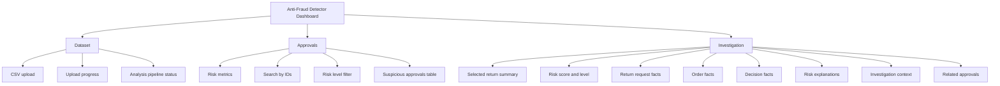

```mermaid
flowchart LR
    A[Analyst opens dashboard] --> B[Upload CSV dataset]
    B --> C[Review upload progress]
    C --> D[Start analysis]
    D --> E[Track pipeline status]
    E --> F[Open suspicious approvals]
    F --> G[Search or filter by risk level]
    G --> H[Select suspicious refund]
    H --> I[Review investigation details]
    I --> J[Read risk explanations]
    J --> K[Compare related approvals]
    K --> L[Decide whether case needs manual follow-up]
```

<h1 align="center">Design Wireframes and User Flows</h1>

This document contains the designer-facing MVP wireframes, mockup references, and user flow diagrams for the Anti-Fraud Detector dashboard.

The current repository deliverables are:

* clickable frontend mockup implemented in React;
* static screenshots exported from the implemented MVP;
* low-fidelity wireframes documented below;
* user journey and screen transition diagrams in Mermaid format.

If a `.fig` source file is required for submission, recreate the frames in Figma using these wireframes and screenshots as the source of truth, then export the Figma file from the Figma editor.

---

<h2 align="center">Implemented Mockup Screenshots</h2>

| Screen | Purpose | Screenshot |
| --- | --- | --- |
| Dataset Upload / Analysis Status | Upload CSV dataset and track pipeline stages. | [01-dataset-upload.png](./assets/screenshots/01-dataset-upload.png) |
| Suspicious Approvals Dashboard | Review suspicious refund approvals with search, filtering, and risk indicators. | [02-suspicious-approvals.png](./assets/screenshots/02-suspicious-approvals.png) |
| Refund Investigation Details | Inspect a single refund approval with risk explanations and related approvals. | [03-refund-investigation.png](./assets/screenshots/03-refund-investigation.png) |

---

<h2 align="center">Information Architecture</h2>



---

<h2 align="center">Primary User Flow</h2>



---

<h2 align="center">Low-Fidelity Wireframes</h2>

<h3 align="center">Dataset Upload / Analysis Status</h3>

```text
+--------------------+-----------------------------------------------------------+
| Logo               | Refund approval risk analytics                            |
|                    |                                                           |
| [Dataset]          | +-------------------------+ +---------------------------+ |
| [Approvals]        | | Upload dataset          | | Analysis progress         | |
| [Investigation]    | |                         | |                           | |
|                    | | [ CSV dropzone ]        | | Uploaded          Waiting | |
|                    | |                         | | Normalizing       Waiting | |
|                    | | Upload progress 100%    | | Normalized        Waiting | |
|                    | | [Start analysis]        | | Building Relations Waiting| |
|                    | |                         | | Scoring           Waiting | |
|                    | +-------------------------+ | Completed         Waiting | |
|                    |                             +---------------------------+ |
+--------------------+-----------------------------------------------------------+
```

<h3 align="center">Suspicious Approvals Dashboard</h3>

```text
+--------------------+-----------------------------------------------------------+
| Logo               | Refund approval risk analytics                            |
|                    |                                                           |
| [Dataset]          | +-------------+ +-------------+ +-----------------------+ |
| [Approvals]        | | Critical 2  | | High-risk 3| | Average score 60.2    | |
| [Investigation]    | +-------------+ +-------------+ +-----------------------+ |
|                    |                                                           |
|                    | +-------------------------------------------------------+ |
|                    | | Suspicious approvals      [Search ID] [Risk filter]  | |
|                    | |-------------------------------------------------------| |
|                    | | Return | Customer | Agent | Amount | Score | Reason | |
|                    | | return_123 ... Critical ... [Review]                 | |
|                    | | return_891 ... Critical ... [Review]                 | |
|                    | | return_377 ... High     ... [Review]                 | |
|                    | +-------------------------------------------------------+ |
+--------------------+-----------------------------------------------------------+
```

<h3 align="center">Refund Investigation Details</h3>

```text
+--------------------+-----------------------------------------------------------+
| Logo               | Refund approval risk analytics                            |
|                    |                                                           |
| [Dataset]          | +-------------------------------------------------------+ |
| [Approvals]        | | return_123                        Risk score: 84     | |
| [Investigation]    | | Refund approved without evidence   Critical          | |
|                    | +-------------------------------------------------------+ |
|                    |                                                           |
|                    | +-------------+ +-------------+ +---------------------+ |
|                    | | Return      | | Order       | | Decision            | |
|                    | +-------------+ +-------------+ +---------------------+ |
|                    |                                                           |
|                    | +------------------------------+ +--------------------+ |
|                    | | Why this is risky            | | Investigation ctx  | |
|                    | | No evidence             +25  | | Customer returns   | |
|                    | | High value refund       +20  | | Agent approval     | |
|                    | | Fast approval           +15  | | Manual overrides   | |
|                    | +------------------------------+ +--------------------+ |
|                    |                                                           |
|                    | +-------------------------------------------------------+ |
|                    | | Related approvals                                      | |
|                    | +-------------------------------------------------------+ |
+--------------------+-----------------------------------------------------------+
```

