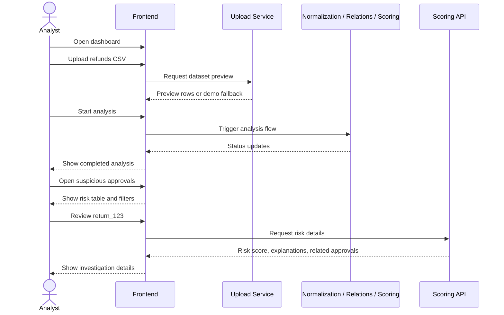
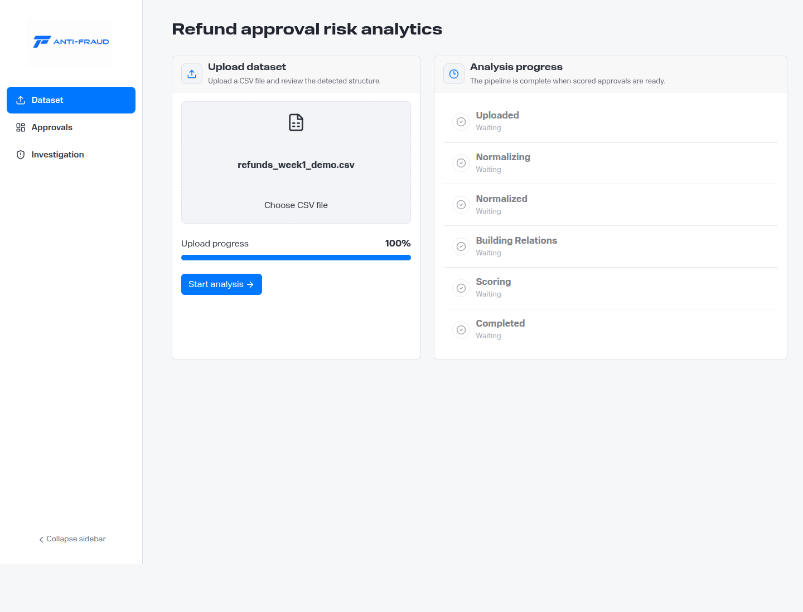
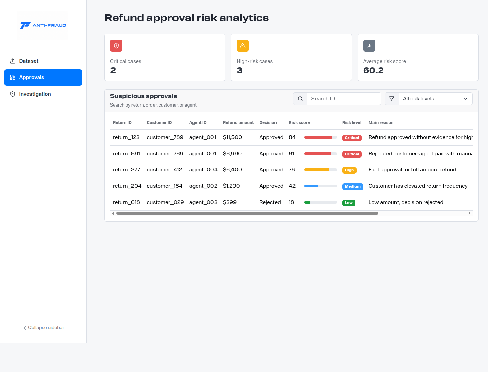
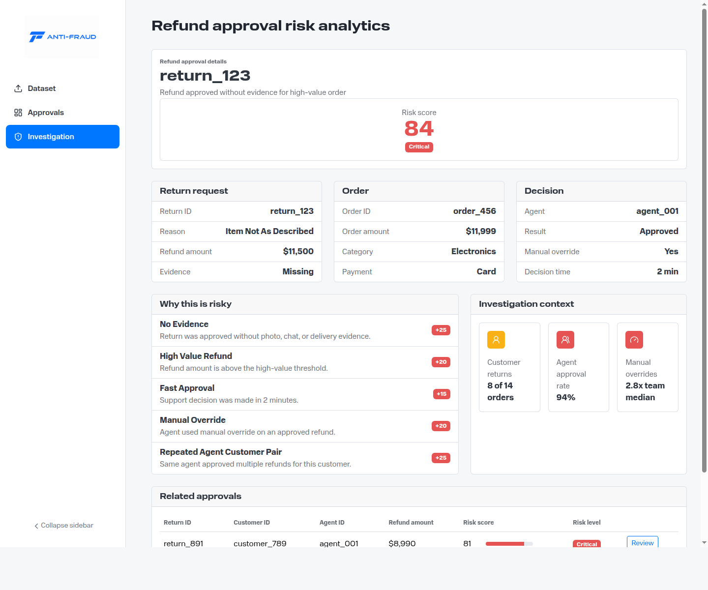

<h1 align="center">Implemented MVP Features and User Journeys</h1>

This document describes the implemented MVP behavior for the Anti-Fraud Detector dashboard and provides screenshots for demo and submission materials.

---

<h2 align="center">Implemented MVP Scope</h2>

The MVP demonstrates an analyst workflow for finding suspicious refund approvals in e-commerce support operations.

Implemented frontend features:

* CSV dataset upload screen with selected file name and upload progress;
* analysis status timeline with pipeline stages from upload to scoring completion;
* suspicious refund approvals dashboard with summary risk metrics;
* searchable approvals table;
* risk level filter;
* row-level risk score bars and risk badges;
* refund approval details screen;
* risk score, risk level, and top reason for a selected approval;
* return request, order, and support decision facts;
* explainable risk reasons with score impact;
* investigation context for customer behavior, support agent behavior, and manual overrides;
* related approvals table for customer-agent pattern review;
* collapsible sidebar navigation between MVP screens.

Implemented backend/API scope available in the repository:

* Go upload service skeleton with dataset upload, preview, storage, and RabbitMQ publishing responsibilities;
* Go relations service skeleton for relation feature and graph-oriented workflow responsibilities;
* Kotlin scoring service with risk model, scoring controller, scoring service, events, and unit tests;
* documented RabbitMQ event pipeline for `dataset.uploaded`, `dataset.normalized`, `refund.relations.built`, and `refund.scoring.completed`;
* documented API contracts, data format, graph model, and scoring rules.

The frontend currently uses demo fallback data when backend endpoints are unavailable, so the full analyst journey can be demonstrated locally.

---

<h2 align="center">Functional User Journey</h2>

---

<h2 align="center">Journey Step 1: Upload Dataset and Track Analysis</h2>

The analyst starts from the Dataset screen. The screen shows the chosen CSV file, upload progress, and the analysis pipeline stages:

* Uploaded;
* Normalizing;
* Normalized;
* Building Relations;
* Scoring;
* Completed.

---

<h2 align="center">Journey Step 2: Review Suspicious Approvals</h2>

After analysis, the analyst opens the Approvals dashboard. The MVP highlights critical and high-risk cases, exposes the average risk score, and lists refund approvals with risk indicators.

The analyst can:

* search by return ID, order ID, customer ID, or support agent ID;
* filter by risk level;
* compare risk score bars and risk badges;
* open a case for detailed review.

---

<h2 align="center">Journey Step 3: Investigate a Refund Approval</h2>

The analyst opens `return_123`, a critical refund approval. The details page explains why this case is suspicious:

* refund was approved without evidence;
* refund amount is high;
* support decision was made in 2 minutes;
* manual override was used;
* the same agent approved multiple refunds for the same customer.

The page also provides order facts, return request facts, decision facts, investigation signals, and related approvals.

---

<h2 align="center">Demo Narrative</h2>

An analyst uploads an e-commerce refund dataset and starts analysis. The system processes the dataset through the documented pipeline, then presents suspicious refund approvals. The analyst opens the highest-risk case and sees a risk score of `84` with `Critical` level. The explanation list shows that the refund was approved without evidence, was high value, was approved in two minutes, used a manual override, and belongs to a repeated customer-agent pattern. This gives the analyst enough context to decide that the case requires manual follow-up.

